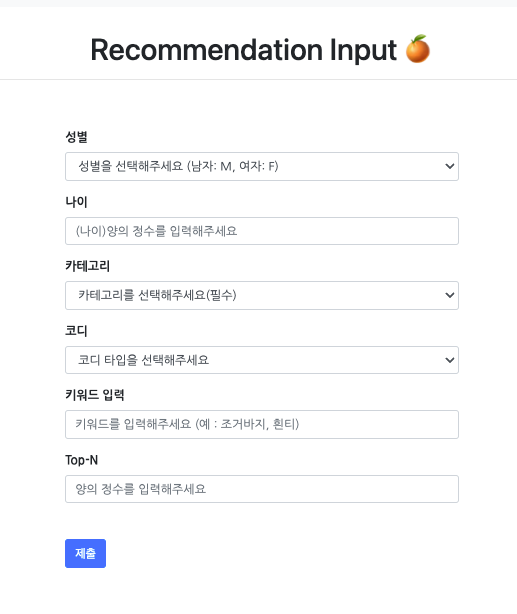
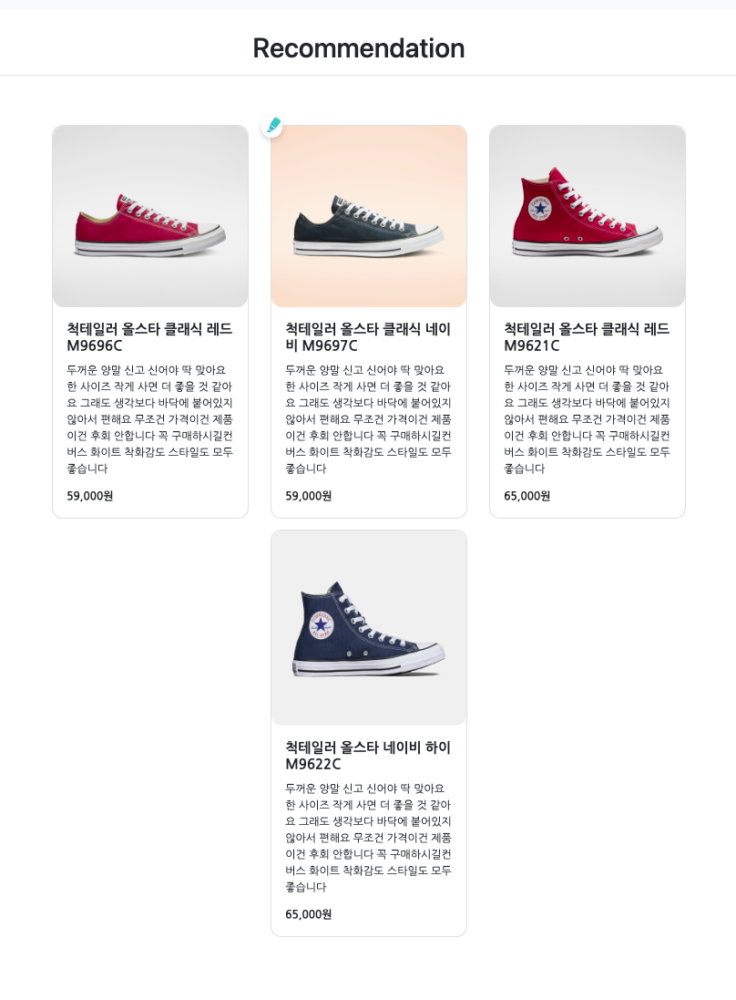

## Django Musinsa Recommendation 

### 개요
- word2vec을 이용한 컨텐츠 based 추천
- 총 상품 9500개
- 리뷰 정보와 컨텐츠 정보들을 가지고 word2vec 임베딩 수행

- 토픽 
  - 코사인 유사도 => Topn df 만듦
  - rating 정렬
  
- word2vec + 이미지  
 - 둘다 겹치는 거 상위 200개 inner join
 - 코사인 유사도 정렬 => topn => DF 만듦
 - rating 정렬

---------

### Stack
  - Django
  - Bootstrap
  - word2vec => (npy 파일 이용)
  - pandas
  - sqlite

### 구현

